<h1>Thirukkural API</h1>

I have provided some API endpoints to fetch the Verses, Translation, Explanation and other things of Thirukkkural. 

<ul>
    <li>
        Deployed on <b>heroku</b> -> https://thirukkuralapp-api.herokuapp.com/
    </li>
    <li>
        Refer the screenshots below for API endpoints and parameters
    </li>
    <li>
        I have provided the SQL file for Data Insertion, also the dataset CSV file.
    </li>
</ul>

<h3>API Endpoints Screenshot : </h3>
<ol>
    <li>
        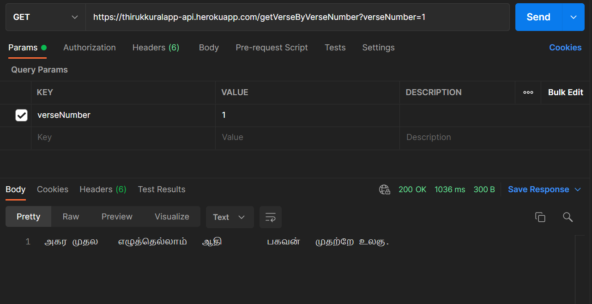
    </li>
    <li>
        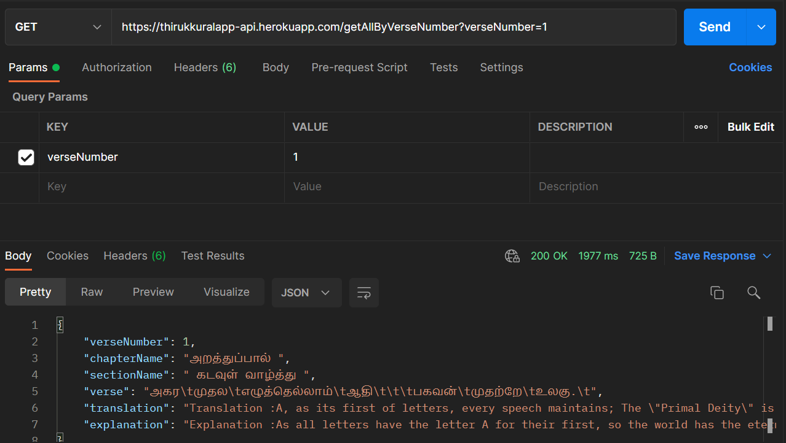
    </li>
    <li>
        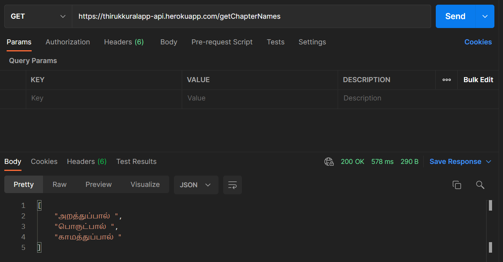
    </li>
    <li>
        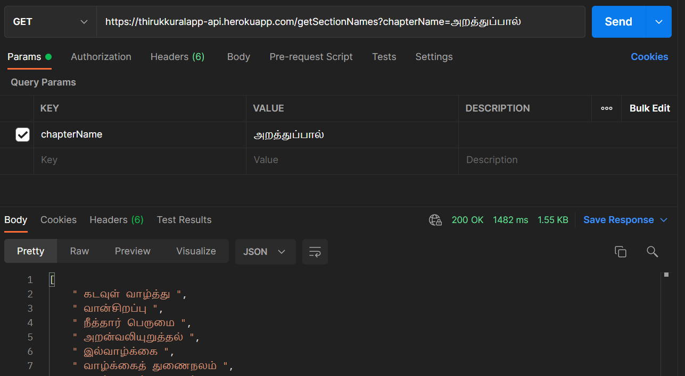
    </li>
    <li>
        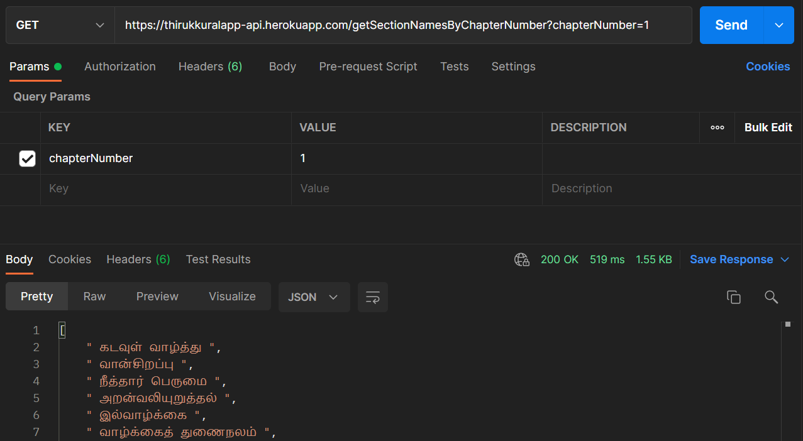
    </li>
    <li>
        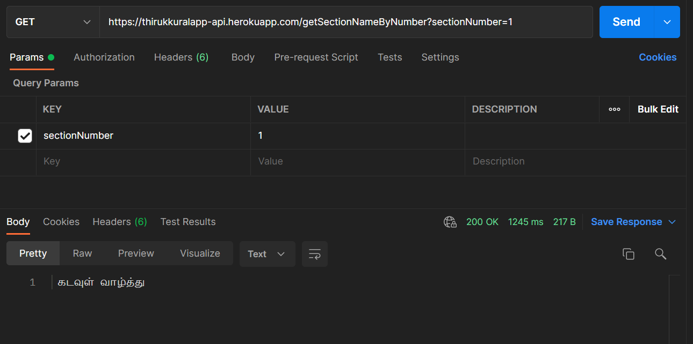
    </li>
    <li>
        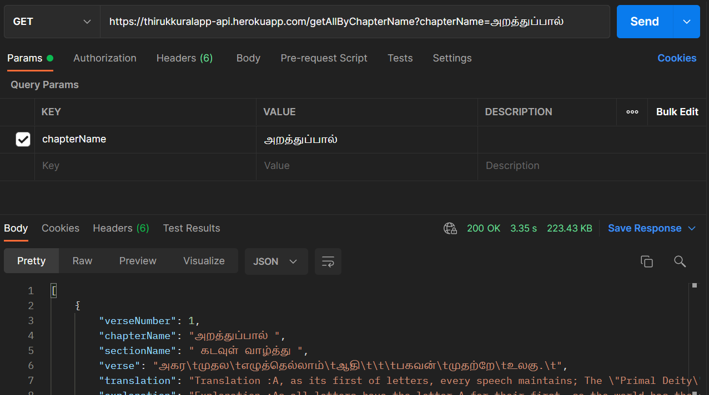
    </li>
    <li>
        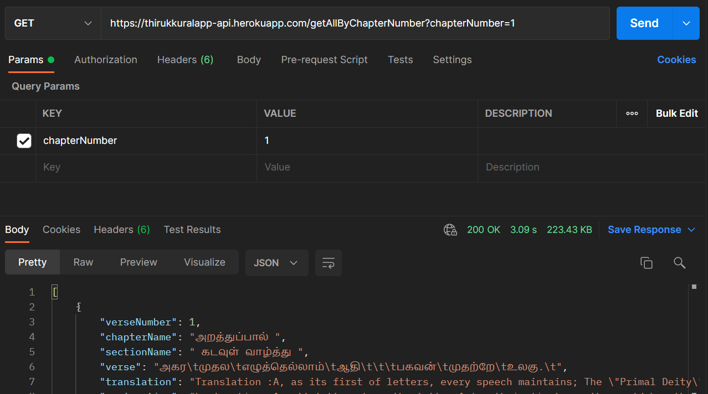
    </li>
    <li>
        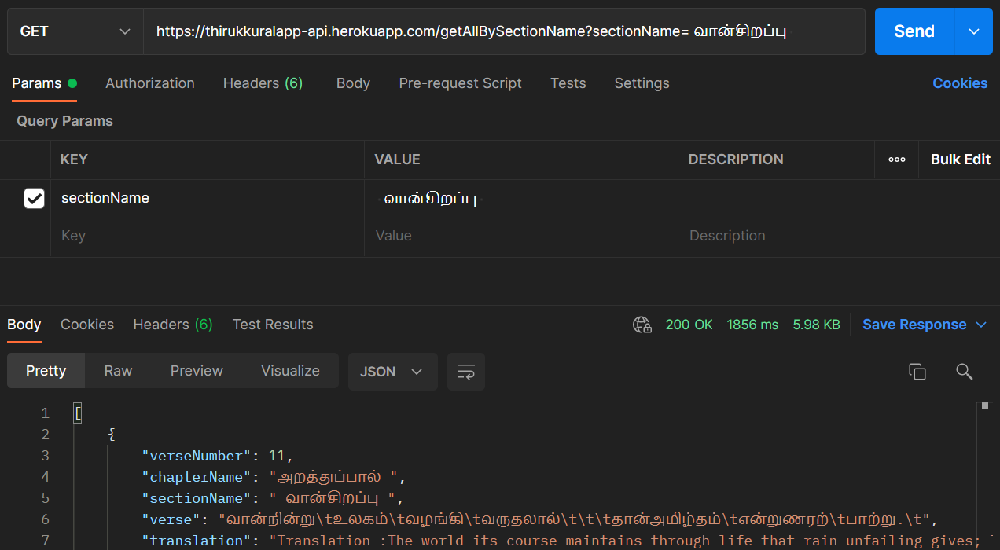
    </li>
    <li>
        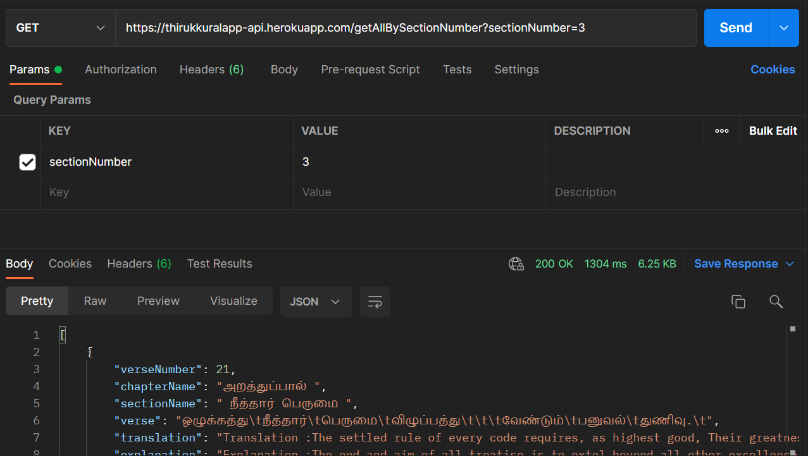
    </li>
    <li>
        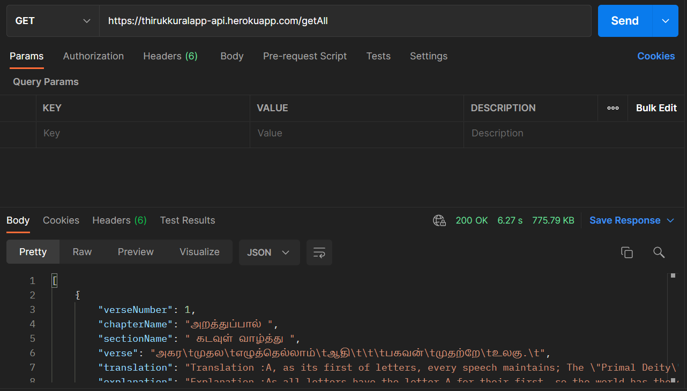
    </li>
    <li>
        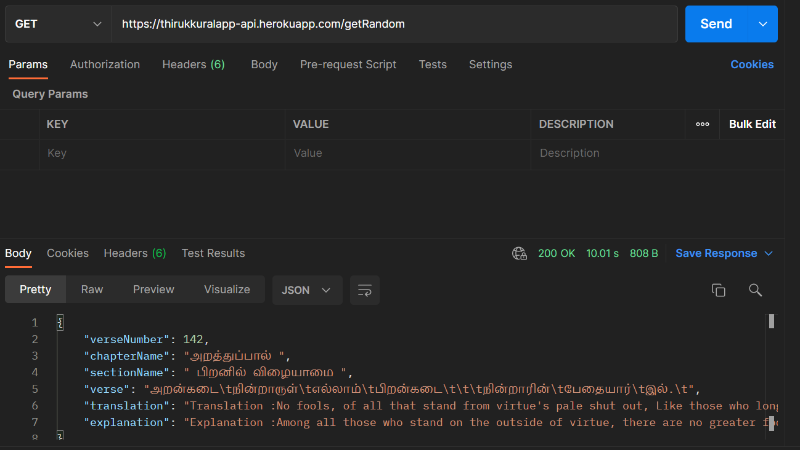
    </li>
</ol>